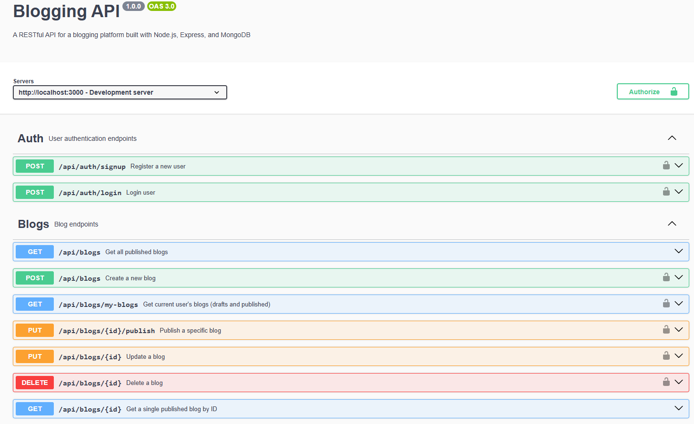

# Blogging API

A secure RESTful API for a blogging platform built with Node.js, Express, and MongoDB.
## Features

### Security
- **Input Sanitization**: All user inputs are sanitized using `validator` library to prevent XSS attacks
- **SQL/NoSQL Injection Prevention**: Query parameters are escaped and validated
- **Helmet Integration**: Security headers configured to hide sensitive server information
- **JWT Authentication**: Secure token-based authentication for protected routes
- **CORS Protection**: Configurable cross-origin resource sharing

### Functionality
- User authentication (signup/login)
- Create, read, update, and delete blog posts
- Draft and publish workflows
- Pagination support
- Advanced search (by title, description, tags, author)
- Sorting by read count, reading time, or timestamp
- Automatic reading time calculation
- Read count tracking

## API Endpoints
SwaggerDoc Image

### Authentication
- `POST /api/auth/signup` - Register a new user
- `POST /api/auth/login` - Login user

### Blogs
- `GET /api/blogs` - Get all published blogs (public)
- `GET /api/blogs/:id` - Get a single published blog (public)
- `GET /api/blogs/my-blogs` - Get current user's blogs (authenticated)
- `POST /api/blogs` - Create a new blog (authenticated)
- `PUT /api/blogs/:id` - Update a blog (authenticated)
- `PUT /api/blogs/:id/publish` - Publish a blog (authenticated)
- `DELETE /api/blogs/:id` - Delete a blog (authenticated)

### Query Parameters
- `page` - Page number (default: 1)
- `limit` - Items per page (default: 20)
- `search` - Search term for title, tags, description, or author
- `sort` - Sort by: `read_count`, `reading_time`, or `timestamp`
- `state` - Filter by state: `draft` or `published`

## API Documentation

Interactive API documentation is available via Swagger UI at:
```
http://localhost:3000/api-docs
```


